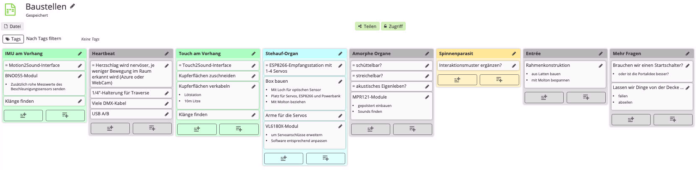

# Sensor Storytelling Hackathon

Dieses Repository dient als Referenz für die Sensor Storytelling Hackathon Website. Im Source Ordner sind die Dokumente gesammlt und unten mit Kommentaren versehen. 

## Hackathon

Der Sensor Storytelling Hackathon widmet sich den Fragen: Welche neuen Wege bietet moderne 
Sensortechnologie, um Bewegung, Klang und 
Raumgestaltung auf der Bühne zu verknüpfen? 
Wie können interaktive Sensortechnik im Objekt- und Figurentheater und in 
partizipativen Theaterformaten eingesetzt werden? 
Welche Erlebnisqualitäten werden damit möglich?

Die Teilnehmenden des Hackathons haben sich in drei Gruppen aufgeteilt: [Screen](#Screen), [Sound](#Sound) und [Space](#Space).

Die Idee für den Hackathon entwickelte sich aus dem Projekt "Interface Marionette". Eine Marionette die mit Hilfe von IMU Sensoren in der Lage ist, ihre Bewegungen an eine digitale Marionette zu übertragen. 

## Screen

### We are Blender

A Blender tutorial comes to life on stage. Six performers in an office setting collaboratively model a new 3D character – but instead of using computers, they become the software itself.

Each person embodies a single tool: one controls object rotation, another the camera position, someone clicks the mouse, another switches between edit and sculpt mode. Simple actions become full-body movements – a mouse click transforms into pulling on a power strip, gestures are exaggerated, everyday objects are hacked into interfaces.

The hidden complexity of our everyday interactions with technology is exposed by the performance. It humorously mirrors human cognition and behavior with computer interfaces, making visible the effort behind seemingly simple digital tasks.
The team collaboratively creates a digital character, evoking the traditions of puppet theater, in which several actors bring a single figure to life. The real theater space exists as a 3D scan within Blender, blurring the barriers between physical and virtual worlds.

|
|:---------:|:----------:|
| 

 
### Technical Description:

A set of ESP32 microcontrollers equipped with IMU sensors were used to capture movement and rotation data from various real objects on stage. The data was transmitted to a central Blender instance running on our server via OSC protocol, using the AddRoutes plugin (https://blender-addons.org/addroutes/). 
A 3D room scan was generated with Polycam (https://poly.cam/) and subsequently scaled to match real-world dimensions. In a separate Unity application, both virtual environments (Blender and Unity) were spatially aligned using spatial anchors, enabling the use of a Head Mounted Display as a virtual camera within the Blender scene. 
Additionally, several custom scripts were developed to handle virtual clicking and mouse movement, allowing for big clicks, beautiful screen interactions and smooth modeling operations.

|
|:---------:|:----------:|
| 
### Credits:

Edda Rabold 
Helene Kummer 
Ronja Lindemann 
Ruxin  Liuu 
Julian Jungel 
Fabian Töpfer

## Sound

### The Word for World is Forrest

Hat hier jemand Bedarf zu flanieren?
Im Raum befindet sich ein Flanierkreis. Mehrere Menschen können darauf gleichzeitig flanieren. Und es müssen nicht immer die gleichen Menschen sein.

Das Audio-Ambiente erinnert an Waldstimmung, die Schritte der Menschen werden von Soundeffekten wie Treten in Match oder Laub untermalt und folgen ihnen im Raum. 

Hören die Menschen auf zu laufen, stoppen nicht nur die direkten Soundeffekte, sondern auch das Ambiente. Wir sind dazu angehalten weiterzulaufen.

Nach einiger Zeit werden die Soundeffekte von Textschnipseln abgelöst, die Bewegung durch eine eher städtische Umgebung beschreiben. Die Textschnipsel werden abgelöst von einem Countdown, der von 50 heruntergezählt wird, pro Schritt.

Bei null angekommen verändert sich die (Licht-) Stimmung, “Big Yellow Taxi” beginnt zu spielen und verfremdet sich mit Hall und Verzerrung zu einer Raumschiff-artigen Atmosphäre. 

Am Ende des Songs finden wir uns zurück im Wald. 

The text passage that the audience can hear by walking is from FLEXEN. Flâneusen* schreiben Städte by Lea Sauer, Mia Göhring, Özlem Özgül Dündar, Ronya Othmann (Hg.)
https://www.verbrecherverlag.de/shop/flexen-flaneusen-schreiben-staedte/ 

The song is not by Taylor Swift but by Joni Mitchell, "Big Yellow Taxi":
https://www.youtube.com/watch?v=94bdMSCdw20 
One of the earliest songs to address environmental concerns (1970)!

The title of our project, which we agreed upon 10 minutes before presenting our project, is inspired by the title of Ursula K. Le Guin’s novel which deals with ideas of preserving vs. conquering novel cultures and ecologies.
https://en.wikipedia.org/wiki/The_Word_for_World_Is_Forest

### Concept

The original idea evolved from walking or going for a walk. Somewhere between going for a walk in the forest and a space walk, we discussed hiking up a hill and sonifying the different heights as the group of people kept walking in the circle.

Ultimately we ended in a more speculative climate catastrophe scenario, where walking in a “real” forest is no longer possible but walking in space is not yet possible. We’re stuck walking in a circle that tries to give us the illusion of being in nature and dream-like glimpses of launching off into space.

### Technical Description

#### HARDWARE (SENSORS + ARDUINO)
The flanierkreis is made up of 24 handmade pressure sensors similar to these:
https://www.kobakant.at/DIY/?p=429
The sensors are made from copper, alu and silverized nylon tapes stuck to plastic sheets with a layer of Velostat piezoresistive plastic on top.
One side of each sensor is connected to a digital pin on an Arduino Mega, the other side of all sensors is inter-connected to analog pin A0. The pressure range of the sensors is around 10,000 - 200 Ohm. We used a voltage dividing resistor of 1K between A0 and +5V to detect a person stepping on a sensor.

#### ARDUINO CODE
The code on the Arduino parses through the 24 pressure sensors, similar to the code for reading this pressure-sensor matrix:
https://www.kobakant.at/DIY/?p=7943

The Arduino code sends out 24 comma separated values that each represent the 10bit pressure value for each sensor, and as a last 25th value the arduino sends a number that should be interpreted as follows:
 100 - nobody on the circle
 0 - people walking on the circle
 1-99 - # people standing still on the circle

| | |
|:---------:|:----------:|
|                         |   |

#### SOUND(s)

A big desire was a multichannel audio setup in the room, to play with spaciality. For that four speakers were placed in the corners of the room with sound effects located to where the people stepped onto the panels.

The first setup included processing the Arduino data in a PureData patch and then using this patch as a VST-Plugin in the DAW Reaper. Reaper has further plugins to use ambisonics which makes handling multichannel output easier.

Going forward the capacities in the group shifted and knowledge hit its limits. For that reason the PureData+Reaper setup was ditched for a single Max/MSP patch which combined the data processing and sound arrangement. 

#### LIGHT
To support the two settings, forest and space, we set up two floodlights and  2 x 3m neopixel strips controlled by an ESP32 running Wled. The lights were not connected to the Arduino data and controlled manually during the showing.

| | |
|:---------:|:----------:|
|                         | |
|                         | |
 

[Forestwalk](https://github.com/user-attachments/files/22621128/forestwalk.mp3) 

 

### Credits:
Jonas Olbrich  
Lisa Passing  
Hannah Perner-Wilson  
Laura Pföhler  
Jan Schulten

## Space

### Invitation to Exploration Spaceship Serious Bush III- Exploration of a new species on Deck 1.41

### THE SETTING
The lab director declares the audience experts in the study of new living beings.
A new creature, discovered in sector ZINO11, has been admitted to Deck 1.41. Viewers are invited to explore the creature. The lab director demonstrates how to enter the creature's interior. They also warn researchers of flashes of light, loud noises, and floating organs. Participants are asked to treat the creature with respect.

| |  | |
|:---:|:---:|:---:|

[Wesen-Objektsubjekt](https://github.com/user-attachments/files/22635362/wesen-objektsubjekt.mp3)

 | 
|:---------:|:----------:|
### THE IDEA
What if space becomes a being? How far do we go in our exploration of things? Do we remain rational or do we become empathetic when beings react to us? How do we touch things with and without a relationship? Are we afraid of hurting things, even when we know they are inanimate material?
The indirect animation of the creatures via threads in the space allows for an immediate reaction to the viewer. Triggered by this reaction, the sensors react and play sounds. This combination triggers a reaction in the viewer that ranges from curious touching of the object to empathetic subjectivization of the objects. The viewer is invited to observe and, if they wish, to question their relationship to inanimate material.

 | 
|:---------:|:----------:|
 | 

### INSIDE THE CREATURE
We are inside a being. Red streaks of light pierce the black organ walls. We hear the being's heartbeat. Amoeba-like organs float through the room. One organ emits sounds when it reacts to onlookers; a larger amoeba emits sounds when it is touched by the researchers. A small organ lies on the floor; someone accidentally steps on the amoeba: it screams!
An organ walks through the room on four legs. Does it react to the researchers or not? 
When you touch smallpox on the organ wall, you hear fragments of thoughts from previous researchers about object-subject relationships.
The heartbeat becomes faster and louder, the light flickers, and suddenly the being bursts. The room becomes bright as day. The laboratory director is surprised that the being was destroyed so quickly by the research and thanks the participating researchers for their curiosity.

 | 
|:---------:|:----------:|
 | 

### Credits:
Wolfram Lakaszus 
Lars 
Alice Therese Gottschalk