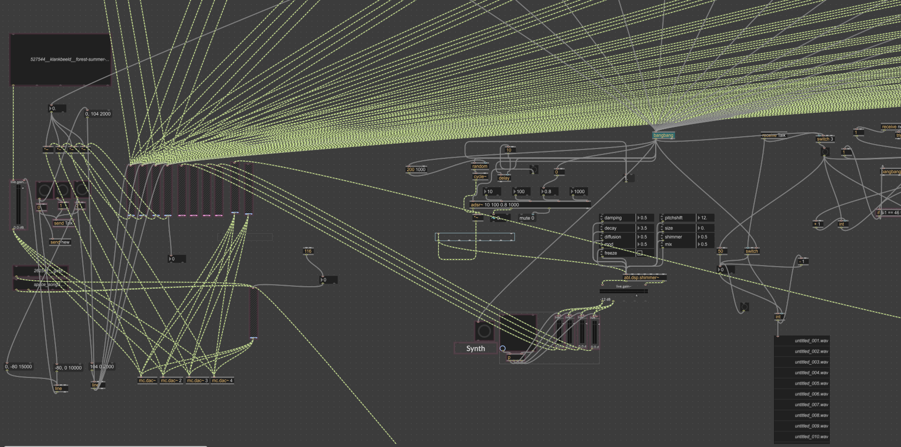
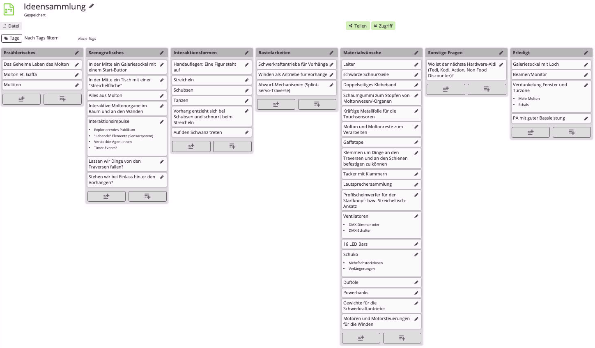
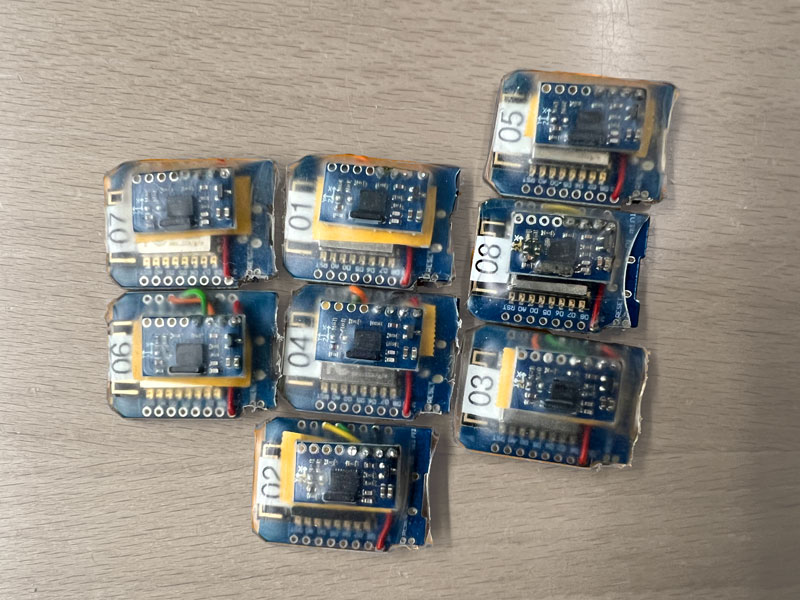
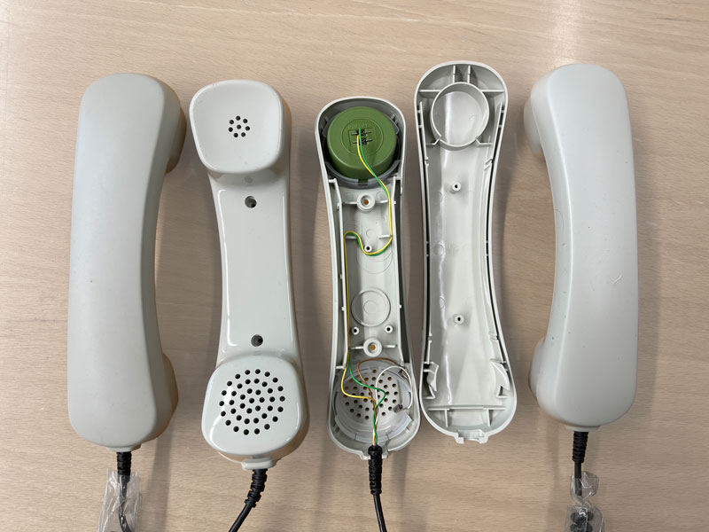
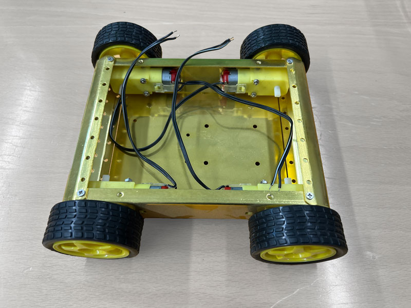

# Sensor Storytelling Hackathon

Dieses Repository dient als Referenz für die Sensor Storytelling Hackathon Website.

## Hackathon
Beim Sensor Storytelling Hackathon arbeiteten die Teilnehmenden in drei Gruppen: [Screen](#Screen), [Sound](#Sound) und [Space](#Space).

<code style="color : red">Bei der Auswahl der Fotos habe ich versucht zu zeigen wie sich die einzelnen Projekte entwickelt haben. Wenn wir die Personen noch mehr im Vordergrund haben wollen kann ich auch nochmal durschschauen.</code> 
<code style="color : red">Ansonsten ist ein bisschen die Frage, was wir alles teilen wollen/können. Also sollen Code Snippets auch hochgeladen werden? Oder geht es nur darum einen Eindruck vom Hackathon zu bekommen?</code>

## Screen

<code style="color : red">Ich habe noch ein Rendering aus dem 3D Scan gemacht. Einige der 3D Dateien hab ich auch hochgeladen. Vielleicht kann man auf der Website auch direkt 3D Modelle anzeigen.</code> 

|
|:---------:|:----------:|
| 

 

|
|:---------:|:----------:|
| 

## Sound

<code style="color : red">Für Github habe ich einen Wikipedia Screenshot gemacht. Für die Website ist es vielleicht charmanter die Wikipedia Page einzubetten anstatt nur den Text einzufügen.</code>

| | |
|:---------:|:----------:|
|                         |   |
| | |
|                         | |
|                         | |
 

[Forestwalk](https://github.com/user-attachments/files/22621128/forestwalk.mp3) 
<code style="color : red">Ich hab die Atmo und ein paar Schritte zusammengeschnitten. Für die Website wäre es natürlich gut wenn es direkt im Browser gespielt wird.</code>

 

## Space

 |  |  

 

 | 
|:---------:|:----------:|
 | 
 | 
 | 
 | 